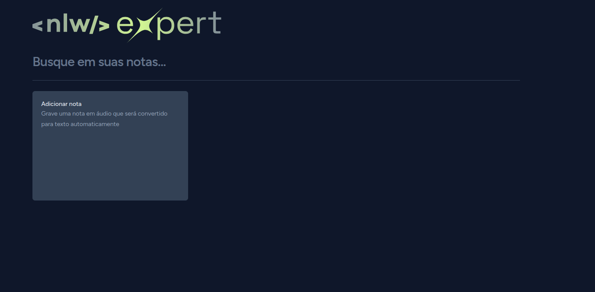

Sure, here's a basic README for your GitHub project:

---

# Voice Notes


[Voice Notes ](https://voice-notes-nlw.vercel.app/)is an application for taking notes using voice, utilizing modern technologies such as React and TypeScript.

## Installation

Make sure you have [Node.js](https://nodejs.org/) and [npm](https://www.npmjs.com/) installed in your development environment.

1. Clone this repository:
   ```
   git clone https://github.com/your-username/voice_notes.git
   ```

2. Navigate to the project directory:
   ```
   cd voice_notes
   ```

3. Install the dependencies:
   ```
   npm install
   ```

## Usage

To start the development environment, use the following command:
```
npm run dev
```

This will start a local server and open the application in your default browser.

To create a production build of the application, use the command:
```
npm run build
```

## Technologies Used

- [React](https://reactjs.org/)
- [TypeScript](https://www.typescriptlang.org/)
- [Vite](https://vitejs.dev/)
- [Tailwind CSS](https://tailwindcss.com/)


## Contributing

Contributions are welcome! Feel free to open an issue or submit a pull request.
